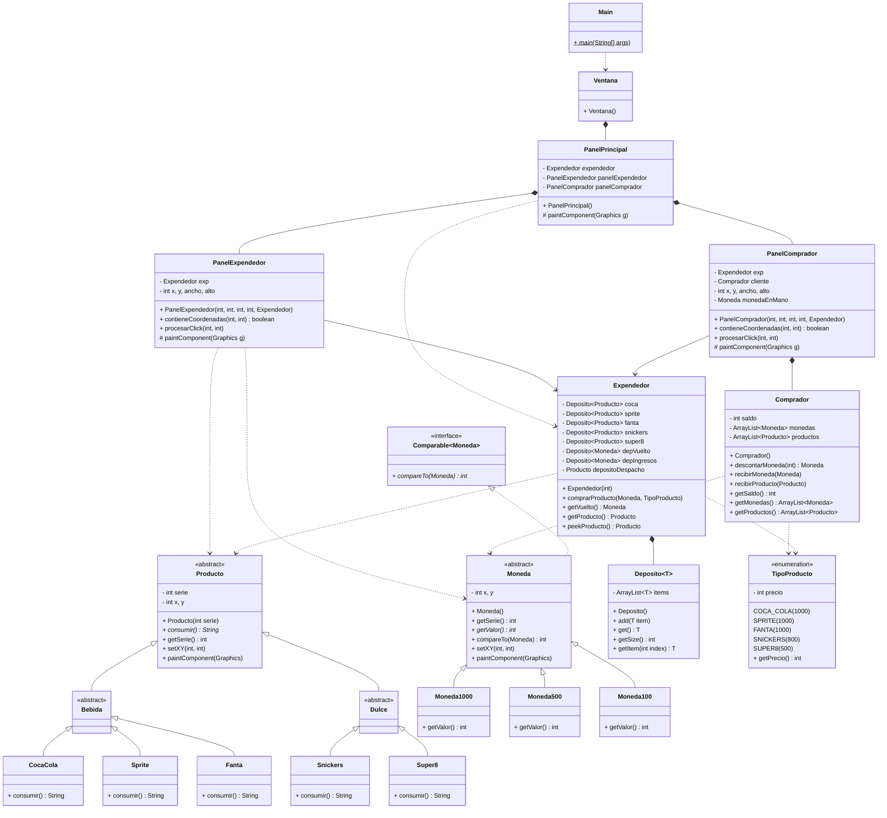

# Tarea 3: Máquina Expendedora 2D
 
---

## Equipo de Desarrollo y Distribución de Tareas

El desarrollo de este proyecto se dividió mediante un flujo de trabajo colaborativo en Git, asignando responsabilidades específicas bajo el patrón de arquitectura MVC:

* **Bastián Pérez Aguayo (Arquitecto de Integración):** Encargado de la estructura base del repositorio y la coordinación de vistas. Implementó las clases `Main`, `Ventana` y `PanelPrincipal`. Diseñó el sistema de enrutamiento de eventos del mouse basado en *Bounding Boxes* (Hitboxes) y estructuró la documentación Javadoc.

* **Tomás Francisco Garrido Fierro (Desarrollador Panel Expendedor):** Responsable de la representación visual de la máquina expendedora. Programó la renderización interna de los depósitos, la lógica visual de reposicionamiento de *stock* y el cajetín de despacho único, asegurando que los productos y monedas se autodibujen con posiciones relativas.

* **María José Norambuena Meza (Desarrolladora Panel Comprador):** Encargada de la interfaz de usuario. Programó el panel de control del cliente mediante `Graphics2D`, gestionando el monedero visual, la botonera de selección de productos y la actualización gráfica del estado del saldo y el vuelto recogido.

---

## Descripción del Proyecto

Esta aplicación es una evolución de la Tarea 1, transformando la simulación lógica de una máquina expendedora en un entorno gráfico interactivo 2D. El proyecto evita el uso de *Layout Managers* automatizados o GUI Builders opacos; en su lugar, delega la responsabilidad de dibujo a cada objeto mediante la sobreescritura del método `paintComponent(Graphics g)`. 

Toda la interactividad del sistema nace de un único `MouseListener` centralizado que propaga las coordenadas $(x, y)$ en cascada hacia los componentes visuales pertinentes.

---

## Arquitectura Visual y Diseño Gráfico

El diseño de la interfaz se estructuró bajo un enfoque de partición espacial geométrica:

1. **Resolución y Lienzo:** La ventana principal opera sobre una resolución base de $1024 \times 768$ píxeles.
2. **Cajas Delimitadoras (Bounding Boxes):** Para garantizar el aislamiento de eventos, la pantalla se divide matemáticamente:
   * **Zona Comprador:** Franja izquierda estática de $300$px de ancho. Renderiza paneles con bordes suavizados (Anti-aliasing), tipografías consistentes y recursos gráficos incrustados (`.png`) para las monedas.
   * **Zona Expendedor:** Área derecha de $724$px de ancho. Dibuja el chasis de la máquina, ordenando dinámicamente el catálogo de bebidas/dulces y asignando colores hexagesimales según el tipo de producto.
3. **Flujo de Renderizado:** Cuando el usuario hace click, el `PanelPrincipal` calcula la inecuación de colisión. Si el click pertenece a un sub-panel, este transforma las coordenadas globales en coordenadas locales (Offsets) para procesar la regla de negocio y gatilla un `repaint()` global para refrescar el búfer de video.

---

## Estructura de Paquetes

El código fuente respeta una estricta separación de responsabilidades (MVC):

* `src/logica/`: Contiene el modelo de negocio (Tarea 1 refactorizada), completamente agnóstico de la interfaz gráfica.
* `src/logica/exceptions/`: Encapsula las excepciones comprobadas (*Checked Exceptions*) del dominio.
* `src/view/`: Contiene los controladores y representaciones gráficas de Swing (`Ventana`, `PanelPrincipal`, `PanelComprador`, etc.).

---

## Diagrama de Clases (UML)

